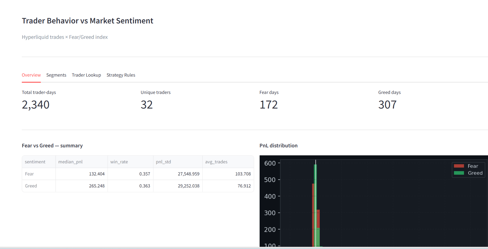
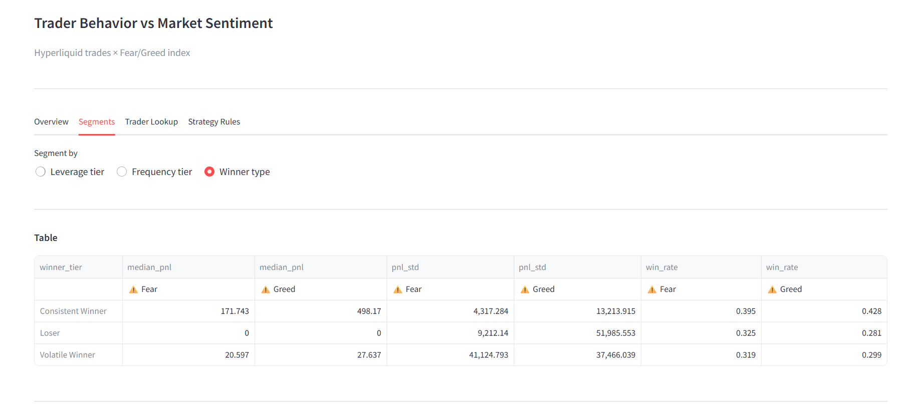
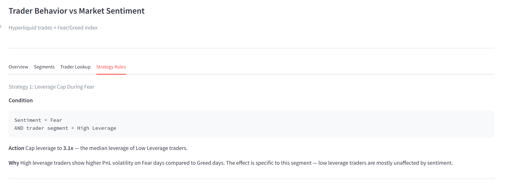

# Trader Performance vs Market Sentiment
### Primetrade.ai — Round-0 Assignment

---

## Setup

```bash
pip install pandas numpy matplotlib seaborn scikit-learn scipy streamlit
```

Place both CSV files in the same folder:
- `fear_greed_index.csv`
- `historical_data.csv`

---

## How to run

**Notebook**
```bash
jupyter notebook trader_sentiment_final.ipynb
```
Run all cells top to bottom. Charts save to a `charts/` folder automatically.

**Dashboard**
```bash
streamlit run dashboard.py
```
Opens at `localhost:8501` in your browser.

---

## Dashboard Preview

### Overview


### Segments


### Strategy Rules


## Files

```
trader_sentiment_final.ipynb   main analysis notebook
dashboard.py                   interactive Streamlit dashboard
README.md                      this file
writeup.md                     1-page summary of methodology + findings
charts/                        output charts (generated by notebook)
```

---

## Data

Two datasets joined on date:

| Dataset | Rows | Key columns |
|---|---|---|
| Fear/Greed index | ~500 days | date, classification, value |
| Hyperliquid trades | ~100k trades | account, pnl, size, side, timestamp |

No leverage column in the raw trade data — leverage is derived as a proxy from position size relative to the dataset median.
